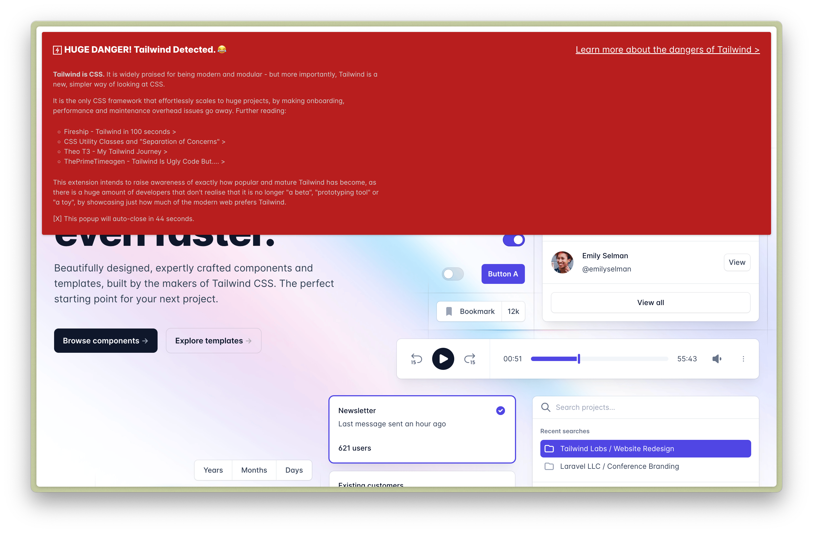
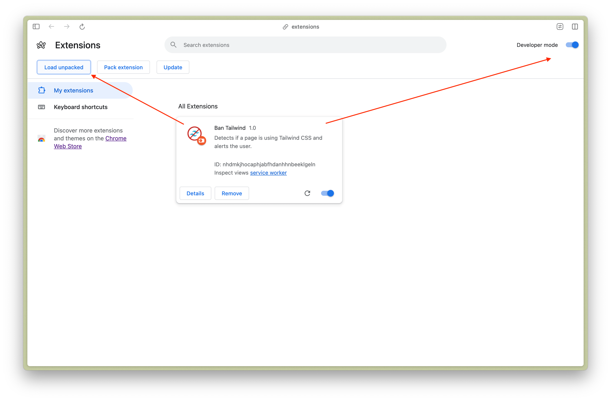
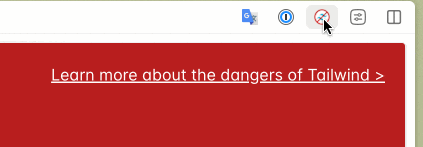

# Ban Tailwind Chrome Extension

Detects if a page is using Tailwind CSS and alerts the user about the dangers of Tailwind.

> While some developers choose to fiddle with Tailwind, the purists among us vow to not touch anything made with it, as it is impure and may cause the next generations of developers to **never learn how to write propper CSS, name and structure it.** (and might be turning the frogs gay.)

---

**Tailwind is CSS.** It is widely praised for being modern and modular - but more importantly, Tailwind is a new, simpler way of looking at CSS.

It is the only CSS framework that effortlessly scales to huge projects, by making onboarding, performance and maintenance overhead issues go away. Further reading:

- <a href="https://www.youtube.com/watch?v=lHZwlzOUOZ4">Fireship - Tailwind in 100 seconds ></a>
- <a href="https://adamwathan.me/css-utility-classes-and-separation-of-concerns/">CSS Utility Classes and "Separation of Concerns" ></a>
- <a href="https://www.youtube.com/watch?v=5MKw-wOpJR8">Theo T3 - My Tailwind Journey ></a>
- <a href="https://www.youtube.com/watch?v=t-eR4hA7obg">ThePrimeTimeagen - Tailwind Is Ugly Code But.... ></a>

This extension intends to raise awareness of exactly how popular and mature Tailwind has become, as there is a huge amount of developers that don't realise that it is no longer "a beta", "prototyping tool" or "a toy", by showcasing just how much of the modern web prefers Tailwind.

## How to install or develop

I won't release this extension to the Chrome Web Store, as I don't want to get endlessly spammed by nigerian price bots, of which the Chrome Web Store is notorious, so you'll have to install it yourself:

0. Clone or download this project.
1. Go to [chrome://extensions/](chrome://extensions/)
2. Tick the "Developer Mode" toggle in the upper right corner.
3. A "Load unpacked" button will appear in the upper left corner.
4. Click it and select this folder.

## Toggle it

Obviously this isn't intended to be used in the real world. But, if you do choose to do so - clicking on the icon will toggle it and disable/enable the popup and the underlying detection logic - after a page reload.

